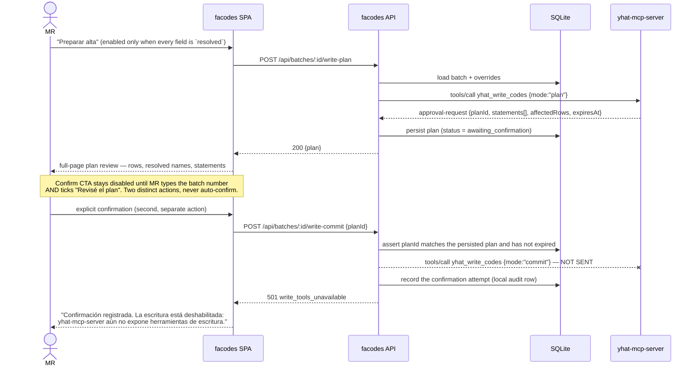

# Design: Direct DB Integration via yhat-mcp-server (facodes UI service)

## Technical Approach

facodes becomes a self-contained, containerized **read-live / write-gated** service: a TypeScript Fastify API that speaks MCP to the already-deployed `yhat-mcp-server`, a React SPA that carries forward v5's table/drawer/fingerprint interaction model, and an embedded SQLite store for review state. Layering is hexagonal: `domain/` (pure business rules, no I/O) sits behind two driven ports — `YhatReadPort` (MCP) and `ReviewStateStore` (SQLite) — and one driving port (`api/`). facodes never opens a SQL Server connection and holds no DB credentials.

## System Architecture

```
                        VPN boundary (existing)
  Browser (MR, any machine) ──TLS──► Caddy ──┬─ /facodes/* ─► facodes        :8080
                                             ├─ /mcp/*     ─► yhat-mcp-server :3000
                                             └─ /audit/*   ─► yhat-mcp-server :3000

  docker network: yhat-internal  (declared `external: true` by facodes)
  ┌───────────────────────────────────┐          ┌───────────────────────────┐
  │ facodes  (Node 22 / Fastify)      │          │ yhat-mcp-server           │
  │  web/     React 19 SPA (Vite)     │          │  yhat_query_entities      │
  │  api/     REST for the SPA        │──MCP────►│  yhat_query (admin only)  │──► SQL Server
  │  domain/  resolver · dedupe · FA  │  HTTP    │  [write tools: ABSENT]    │       YHat
  │  mcp/     YhatReadPort adapter    │  /mcp    └───────────────────────────┘
  │  store/   ReviewStateStore (SQLite)│
  └──────────────┬────────────────────┘
                 │ named volume `facodes-data`
          review-state.db (SQLite, WAL)
```

facodes reaches `yhat-mcp-server` **container-to-container** at `http://yhat-mcp-server:3000/mcp`, not back out through Caddy. It must still satisfy that endpoint's existing gate (`authorizeInternalMcpRequest`): send `x-yhat-internal-identity: ${YHAT_INTERNAL_IDENTITY}` and a `Host` inside the allowlist (`yhat-mcp-server` resolves via the shared network; `YHAT_INTERNAL_HOST` is set accordingly).

## Architecture Decisions

### Decision 1 — Business logic location: hybrid, split by determinism

**Choice**: Deterministic rules move into `domain/` as tested TypeScript over live MCP reads. Judgment-shaped ranking stays optional and external, behind an `AnalysisAdvisor` port. Both produce the same `BatchAnalysis` contract (PRD §6 JSON), which becomes facodes' anti-corruption boundary.

| Rule | Home | Why |
|---|---|---|
| Duplicate detection (BranchRep vs live `Codes`) | `domain/` (code) | Safety-relevant; a missed duplicate writes a wrong production row. Must be deterministic and testable. |
| "Same Branch+Rep = same FA" propagation | `domain/` | Pure rule over batch + live data. |
| Pershing/UBS format parsing, `-Unidentified` generics | `domain/` | Deterministic string rules stated in PRD §1. |
| Catalog resolution for the 8 fields (exact + normalized match) | `domain/` | Live `yhat_query_entities` lookups; no judgment needed. Replaces embedded catalogs entirely. |
| Fuzzy FA name ranking, false-company detection, evidence prose | `AnalysisAdvisor` port (LLM), optional | Heuristic and cheap to correct — MR confirms every field anyway. |
| Legacy paste-JSON ingest | `AnalysisAdvisor` "manual" adapter | Migration bridge: the v5 contract keeps working while `domain/` is built rule by rule. |

**Alternatives rejected**: (a) full reimplementation — forces porting fuzzy heuristics that exist only as skill prompts, with no oracle to detect drift; (b) full LLM analysis over live data — keeps drift, makes the app non-deterministic and untestable, adds an LLM credential + per-batch cost, and re-couples every read to a chat turn.

**Rationale vs. the drift risk**: drift is only dangerous where a wrong answer reaches production silently. Those rules are exactly the deterministic ones, so they become code with tests and PRD v5 as their spec. The rest degrades to a suggestion the user reviews, so LLM drift there is visible and recoverable. facodes runs its core with zero LLM credentials.

### Decision 2 — Review-state datastore: embedded SQLite on a named volume

**Choice**: SQLite (WAL, `better-sqlite3`) at `/data/review-state.db` on the `facodes-data` volume; numbered SQL migrations applied at boot (same pattern as `yhat-mcp-server/src/migrate.ts`).

The requirement "resumable from another machine" is satisfied by **centralizing the service**, not the database: the store is server-side, the client is a browser reaching the same container over the VPN. A networked DB buys nothing here.

| Option | Tradeoff | Decision |
|---|---|---|
| SQLite embedded | One writer (single user), zero extra container, zero new credential, backup = file copy of one volume | **Chosen** |
| Postgres container | Reintroduces a DB password into facodes' env (contradicts "zero DB credentials"), extra container + `pg_dump` job, no benefit at 1 user | Rejected |
| Redis | Not durable-first; wrong shape for relational batch/override state | Rejected |
| JSON files on the volume | No atomicity or transactions; hand-rolled locking | Rejected |
| `localStorage` only | Fails the requirement outright (already rejected in the proposal) | Rejected |

Backup: `docker run --rm -v facodes-data:/data …  sqlite3 /data/review-state.db ".backup /out/…"`. Escape hatch: persistence is behind `ReviewStateStore`, so a Postgres move is a driver swap, not a rewrite.

### Decision 3 — Stack: TypeScript end to end

**Choice**: Node 22 LTS · Fastify 5 · `@modelcontextprotocol/sdk` (client, Streamable HTTP) · React 19 + Vite · Vitest · `better-sqlite3`.

**Rationale**: `yhat-mcp-server` is TypeScript on the same SDK, so the client half is first-class and tool schemas stay type-shared. v5's validated interaction patterns (drawer, 9-tick fingerprint, 3-mode FA change) are React and carry forward directly. Vitest mirrors the sibling repo's `tests/*.test.ts` setup, which closes the "zero test infra" risk and lets `config.yaml` `tdd` flip to `true`.

**Alternatives rejected**: Python/FastAPI (second ecosystem, no schema sharing, no React reuse); .NET (zero UI reuse, unvalidated skill fit); Next.js (SSR/RSC overhead for a single-user VPN SPA); a single self-contained HTML page like `/audit` (fine for a read-only viewer, but this UI holds batch overrides, drawer state, and a 3-mode FA editor).

**Artifact vs. product language**: this document and all code/comments are English; **UI copy stays Spanish**, matching PRD v5 and the existing `/audit` viewer.

## Write-Confirmation Gate (sequence)



Invariants: no single request may both plan and commit; the commit request carries only a `planId` (never statements), so the committed bytes are the reviewed bytes; the disabled state is rendered with a stated reason, not a silent no-op. This is the direct successor of the commented `COMMIT`/`ROLLBACK` gate. Until `sdd/yhat-mcp-server/pending-write-tools` lands, both MCP write calls above are behind a `WRITE_TOOLS_ENABLED=false` capability flag; the plan step degrades to a locally-rendered preview built by `domain/`.

## UI Architecture (YHAT Design System v1.0)

Page shape follows YHAT's landing order: Header → Title → Filters → KPIs → Visualization → Footer. All spacing is 8pt-scale.

| v5 pattern | YHAT mapping |
|---|---|
| Header | 64px, `#FFFFFF`, border-bottom 1px `#E5E7EB`, shadow `0 1px 3px rgba(0,0,0,.05)`, 32px horizontal padding |
| Page title | Destacado 1 (Bold 32/40), centered, 120px centered separator; margin 48px top / 32px bottom |
| Legend-as-filter + "Sólo pendientes" + density toggle | Filter container: radius **8px**, padding 16px, border 1px `#E5E7EB`, flex row gap 16px. Inputs radius 4px, focus 2px `#2C3642` |
| (new) Batch summary | KPI row ×4 — Codes, Resueltos, Pendientes, FAs nuevos. Radius **8px**, centered, value Destacado 2, label Pie de Foto in Gris 500, gap 24px |
| Batch table | Visualization: container border **0**, radius 0; cells 1px `#E5E7EB`, padding 12px 16px; header bg `#F9FAFB` Bold 14 Gris 700; hover `#F3F4F6`; selected `#EFFDFF`; left-aligned title with 1px separator |
| Edit drawer | Radius 12px (overlay tier), `role="dialog" aria-modal="true"`, Escape closes without losing table state (`/audit` slide-over precedent) |
| Buttons | "Aceptar sugerencia" = Primario `#2C3642`; "Marcar para revisar" = Secundario outline; "Restaurar sugerencia"/"Limpiar filtros" = Texto; Acento `#00E3DB` is reserved for exactly one control — the write-confirm CTA |
| Disabled commit | `#98A2B3`, `cursor: not-allowed`, plus visible reason text (never state-by-color alone) |
| Empty states | 48px padding, 48px icon Gris 400, Destacado 3 Gris 700, body Gris 500, centered — e.g. "No hay lote cargado." |

**Status encoding (texture + color + glyph, never color alone)** — mapped onto YHAT's documented badge variants:

| State | Fill / text | Texture | Glyph |
|---|---|---|---|
| `resolved` | `#12B76A` / `#FFFFFF` | solid | ✓ |
| `needs_confirm` | `#FEF3C7` / `#92400E` (Alerta) | 45° diagonal stripes | ! |
| `needs_input` | `#FEE2E2` / `#991B1B` (Error) | 2px dotted border | ✗ |
| `no_data` | `#E5E7EB` / `#667085` (Inactivo) | horizontal hatch | – |

**Fingerprint**: 9 ticks (1 FA + 8 fields), each a 4×16px `<button>` carrying its state fill + texture + `aria-label`, 2px inter-tick gap inside an 8px-padded group, 8px from BranchRep; hit area expands to 44×44px below 768px.

**Removed from v5**: the accent-color toggle — it contradicts YHAT's single brand palette. Density toggle survives (both densities keep 8pt multiples: 12px/16px vs 8px/16px cell padding).

## File Changes

| File | Action | Description |
|---|---|---|
| `package.json`, `tsconfig.json`, `vitest.config.ts`, `vite.config.ts` | Create | TS workspace, test runner, SPA build |
| `src/domain/` | Create | Resolver, dedupe, FA matching, `BatchAnalysis` types — pure, no I/O |
| `src/ports/{YhatReadPort,ReviewStateStore,AnalysisAdvisor}.ts` | Create | Driven port interfaces |
| `src/mcp/yhat-client.ts` | Create | MCP Streamable-HTTP client, identity header, retry/timeout, error mapping |
| `src/store/sqlite/{index.ts,migrations/*.sql}` | Create | `ReviewStateStore` driver + boot migrations |
| `src/api/routes/{batches,write}.ts` | Create | SPA REST surface incl. plan/commit gate |
| `src/web/` | Create | React 19 SPA: table, drawer, fingerprint, FA editor, plan review |
| `src/web/styles/tokens.css` | Create | YHAT v1.0 CSS custom properties, verbatim |
| `Dockerfile`, `docker-compose.yml`, `.env.example` | Create | Multi-stage build; compose joins `yhat-internal` as external |
| `deploy/caddy-facodes.snippet` | Create | `route /facodes/* { reverse_proxy facodes:8080 }` for the existing site block |
| `openspec/config.yaml` | Modify | `tdd: true`, `test_command: "npm test"`, `build_command: "npm run build"` |
| `archive/v5-artifact.jsx` | Create | Rollback prerequisite — archive the v5 source before cutover |

## Interfaces / Contracts

```ts
interface YhatReadPort {
  queryEntities(q: {
    entity: string; attributes?: string[];
    filters?: { attribute: string; operator: string; value: unknown }[];
    joins?: string[]; orderBy?: { attribute: string; direction: "ASC" | "DESC" };
    limit?: number;                                    // server default 1000
  }): Promise<Record<string, unknown>[]>;
}

interface ReviewStateStore {
  saveBatch(b: BatchAnalysis): Promise<void>;
  loadBatch(id: string): Promise<BatchAnalysis | null>;
  putOverride(batchId: string, codeId: string, field: string, v: FieldOverride): Promise<void>;
  savePlan(batchId: string, plan: WritePlan): Promise<void>;   // status: awaiting_confirmation
  recordConfirmation(batchId: string, planId: string): Promise<void>;
}
```

`BatchAnalysis` is PRD §6 verbatim, versioned with a `contractVersion` field so the legacy paste path and the live resolver stay interchangeable.

## Testing Strategy

| Layer | What | Approach |
|---|---|---|
| Unit | Resolver, dedupe, "same Branch+Rep = same FA", Pershing/UBS parsing, status derivation | Vitest, table-driven fixtures from PRD v5 |
| Integration | MCP client against a stubbed `/mcp`; SQLite store round-trip + migrations; plan→commit gate rejects a single-call commit and an expired/mismatched `planId` | Vitest + in-process Fastify + `:memory:` SQLite |
| E2E | Load batch → resolve all fields → plan → confirm → observe the disabled-write 501; restart the container and resume the same batch | Playwright against Compose |
| Contract | `BatchAnalysis` schema round-trips both the legacy paste JSON and the live resolver output | Zod schema + golden fixtures |

## Threat Matrix

N/A — no routing of untrusted input, shell command, subprocess spawn, VCS/PR automation, or executable-file classification boundary. One security boundary is worth naming without the matrix: user-shaped entity-query parameters are forwarded to `yhat_query_entities`, which compiles them to T-SQL server-side. facodes MUST validate them with Zod against the documented schema and MUST NOT expose `yhat_query` (raw SQL, admin-only) to the UI.

## Migration / Rollout

Full replacement, no parallel run. Order: (1) archive the v5 artifact source into `archive/` — a hard prerequisite of the rollback plan; (2) ship read-live + review + persistence with `WRITE_TOOLS_ENABLED=false`; (3) enable the commit call only after `sdd/yhat-mcp-server/pending-write-tools` ships. SQLite migrations run forward-only at boot; rollback is `docker compose down` plus a volume snapshot restore.

## Open Questions

- [ ] Confirm the `yhat-mcp-server` Compose network name and whether facodes is allowed to join it (assumed `yhat-internal`; the sibling repo's compose file is not in the local checkout).
- [ ] Confirm the future write tool's name and approval-request payload shape — the sequence above uses a provisional `yhat_write_codes` contract that the cross-project change may rename.
- [ ] Whether `better-sqlite3` prebuilds cover the bastion's architecture, or the image needs a build stage (fallback: Node 22 `node:sqlite`).
